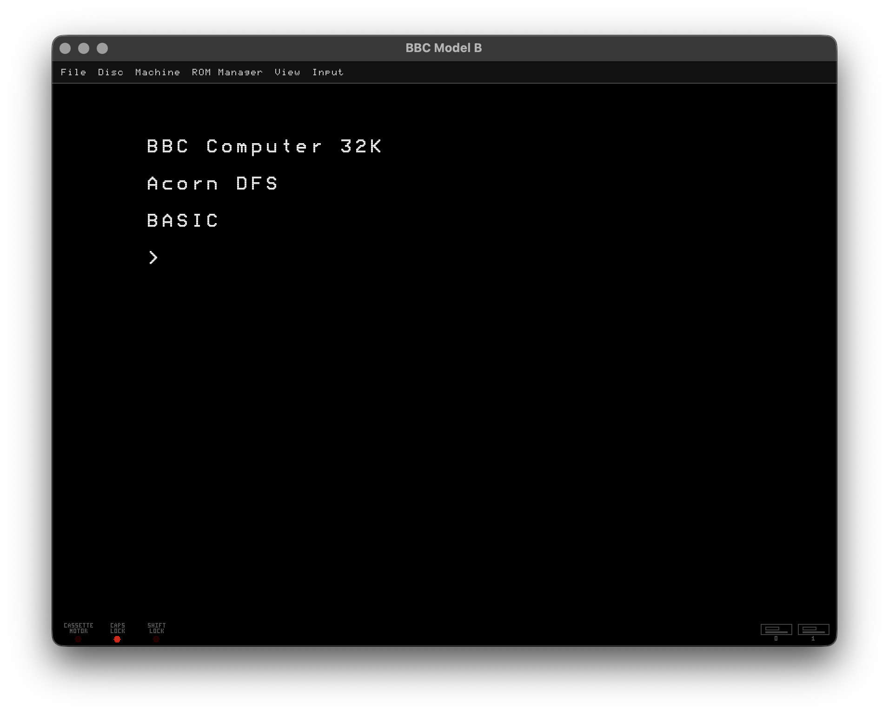
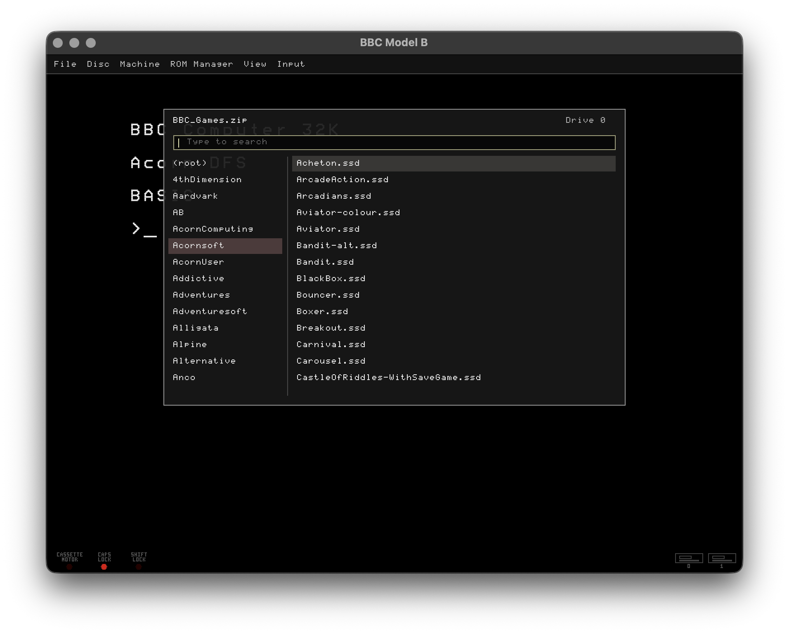
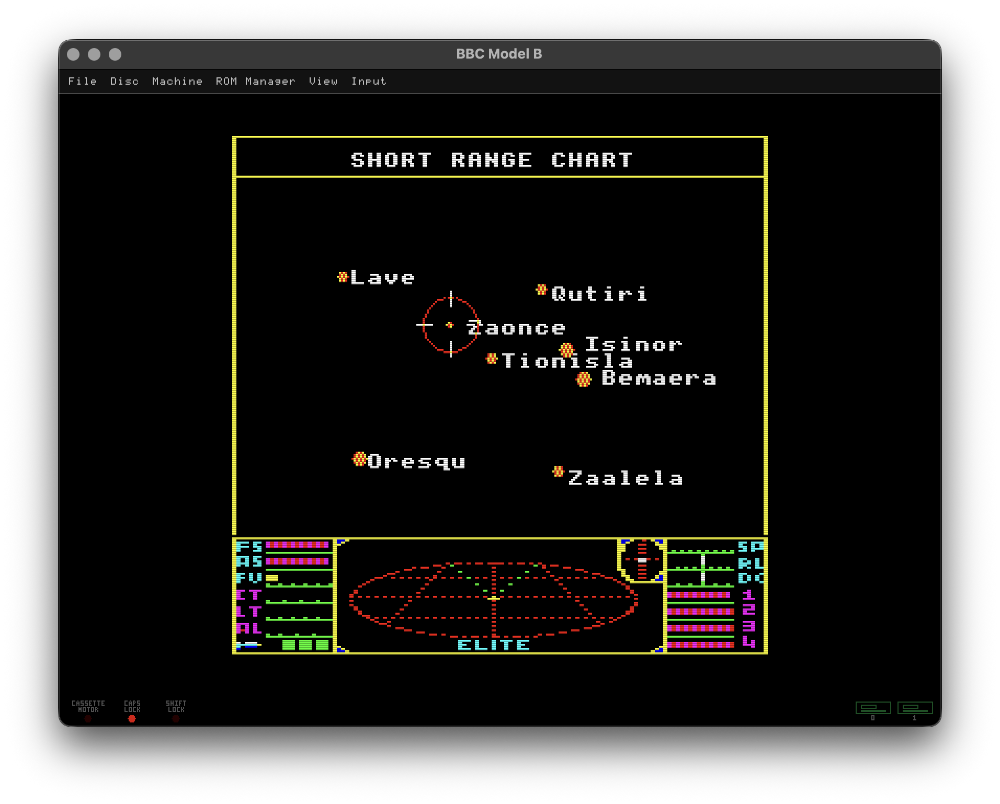
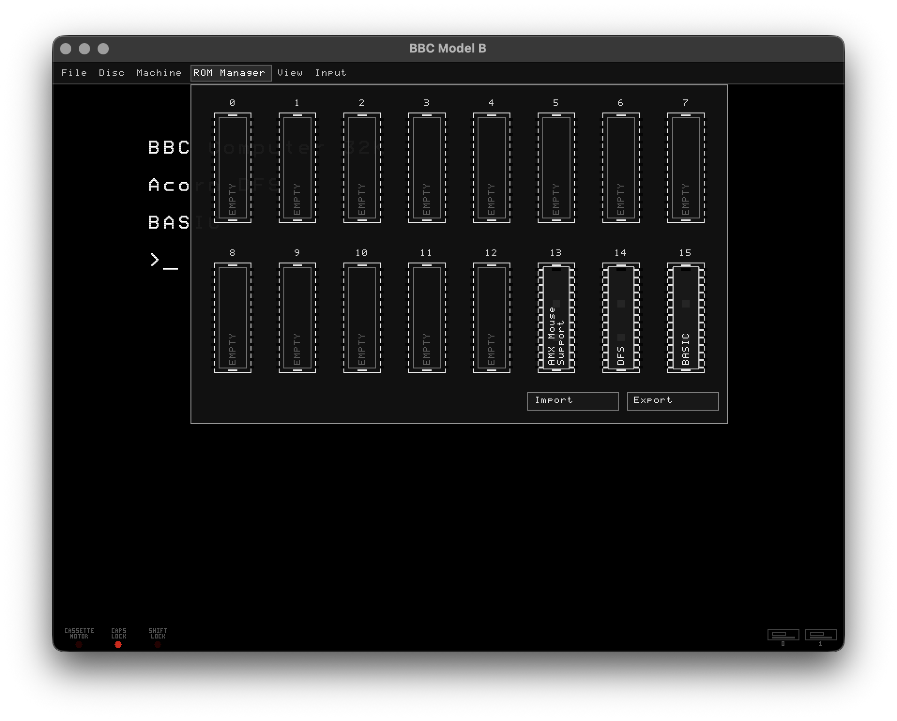
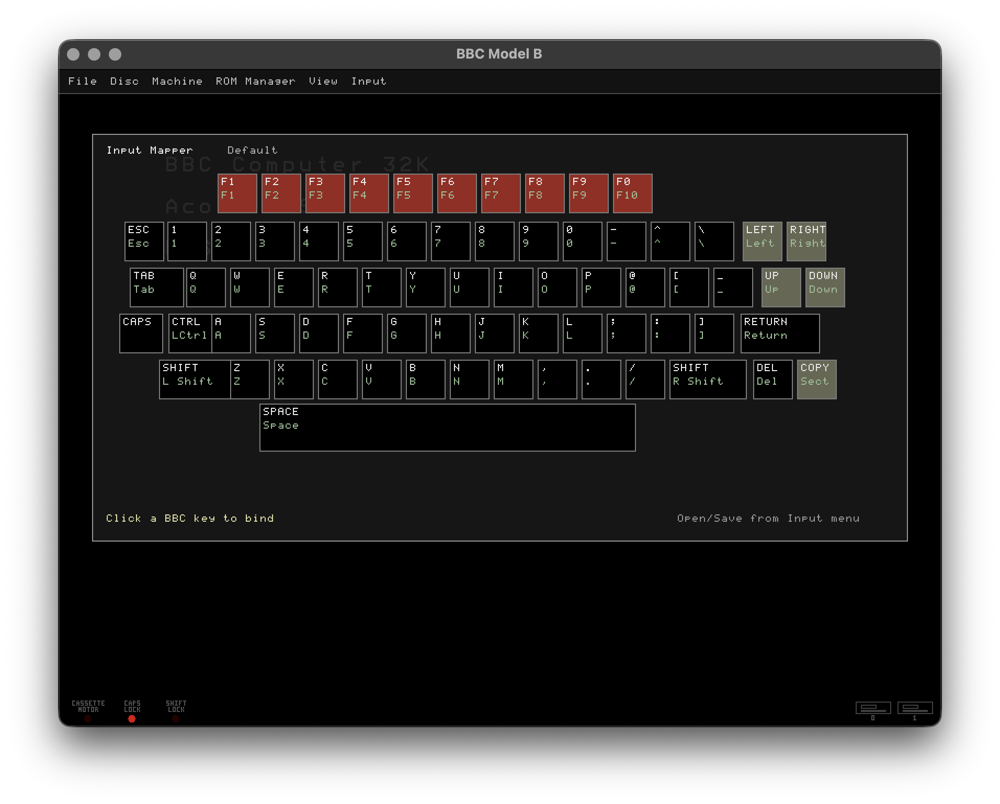
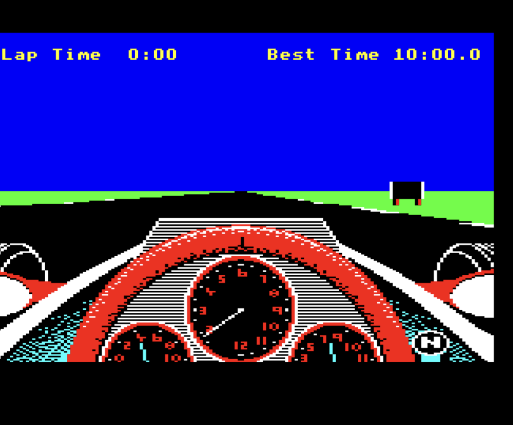

# BBC Model B Emulator Features

A short feature index for the emulator. The README contains the detailed guide.

## Core Emulation

<table>
<tr>
<td width="430" valign="top">

- 2 MHz NMOS 6502 CPU
- BBC Micro OS 1.20 and BASIC II ROM support
- Acorn DFS with 8271 disc controller emulation
- System and user 6522 VIA emulation
- BBC video hardware with CRTC/ULA behaviour
- SN76489 sound emulation
- BBC keyboard matrix input

</td>
<td width="340" align="left">

</td>
</tr>
</table>

## Software Loading

<table>
<tr>
<td width="430" valign="top">

- SSD and DSD disc image mounting
- ZIP archive disc browser
- Search and keyboard navigation in archive browser
- Blank SSD/DSD creation
- Host file mounting
- Optional command-line autoboot control

</td>
<td width="340" align="left">

</td>
</tr>
</table>

## Save And Resume

- `.sav` save states
- Recent save-state menu entries
- Command-line `--load-state`
- Tube and sideways ROM state included in save states

## 65C02 Tube

<table>
<tr>
<td width="430" valign="top">

- 65C02 Tube co-processor emulation
- Tube ULA FIFO bridge
- DNFS/Tube ROM switching
- HI-BASIC support
- Menu and command-line Tube enablement

</td>
<td width="340" align="left">

</td>
</tr>
</table>

## Sideways ROMs

<table>
<tr>
<td width="430" valign="top">

- Visual 16-bank ROM Manager
- Add, remove, move, and inspect ROMs
- ROM title and service/language entry display
- Import/export named ROM layouts
- Protected BASIC bank handling

</td>
<td width="340" align="left">

</td>
</tr>
</table>

## Input

<table>
<tr>
<td width="430" valign="top">

- Visual BBC keyboard mapper
- Explicit input profile save/open
- Optional `Assets/DefaultInputProfile.json`
- Clipboard paste
- BBC CAPS LOCK and SHIFT LOCK handling
- SDL joystick and game controller support
- Keyboard joystick fallback

</td>
<td width="340" align="left">

</td>
</tr>
</table>

## Display And UI

- SDL menu bar
- Fullscreen toggle
- Scanline overlay
- Pause and frame advance
- Notice bar messages
- Drive, cassette, caps, and shift lock indicators
- Mounted-disc hover labels

## Media Capture

<table>
<tr>
<td width="430" valign="top">

- Screenshot capture
- Game/disc-aware screenshot naming

</td>
<td width="340" align="left">

</td>
</tr>
</table>

## AMX Mouse

- AMX mouse ROM support
- Host relative mouse capture
- `*MOUSE` and `*POINTER` support path

## Hayes Modem

- Functional Hayes-compatible modem on the BBC RS423 serial path
- Machine menu enablement plus `BBC_HAYES_MODEM=1` startup option
- TCP dial-out with `ATDThost:port`
- Command mode, online mode, hang-up, reset, echo, identity, and escape handling
- Common terminal init-string compatibility commands and S-registers
- Fixed 2400 baud modem-to-BBC data pacing
- Hayes top-panel LEDs for AA, CD, OH, RD, SD, TR, and MR
- Menu loopback and modem reset controls
- Serial trace and ACIA loopback environment options for testing

## Command Line

- Disc, drive, blank-disc, speed, Tube, and save-state options
- Headless runtime mode
- DFS `!BOOT` inspection
