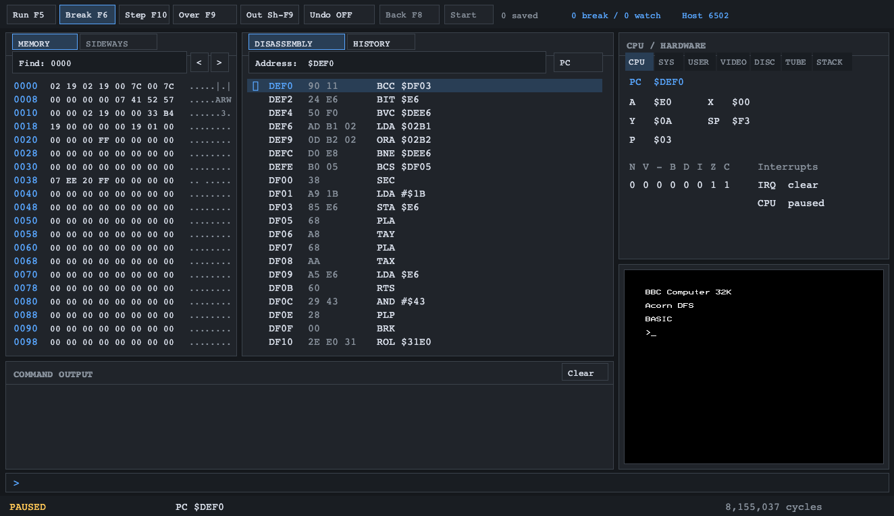

# BBC Model B Emulator

A BBC Micro Model B emulator written in C# and .NET. Run BBC BASIC, games and other software with emulated disc drives, tape, sound and optional peripherals, plus a built-in 6502 debugger.




## Build and run

Install the .NET 10 SDK and SDL2 runtime support (used through `ppy.SDL2-CS`). Place your legally obtained BBC ROMs in `ROMS/`:

```text
ROMS/OS12.rom
ROMS/BASIC2.rom
ROMS/DFS-0.9.rom
```

From the repository root, build and start at BASIC:

```bash
dotnet build BBC_MODEL_B.csproj
dotnet run --project BBC_MODEL_B.csproj
```

To boot a disc image:

```bash
dotnet run --project BBC_MODEL_B.csproj -- Games/Phoenix.ssd
```

Use the **File** menu to load media. **F12** is BREAK; **Shift+F12** boots a mounted disc.

See the [Wiki](https://github.com/jimbojetset/BBC_MODEL_B/wiki) for the full user manual, command-line options, keyboard controls, peripherals and debugger guides.

Licensed under [GNU GPL v2](LICENSE). ROMs and commercial software remain the property of their respective rights holders.
