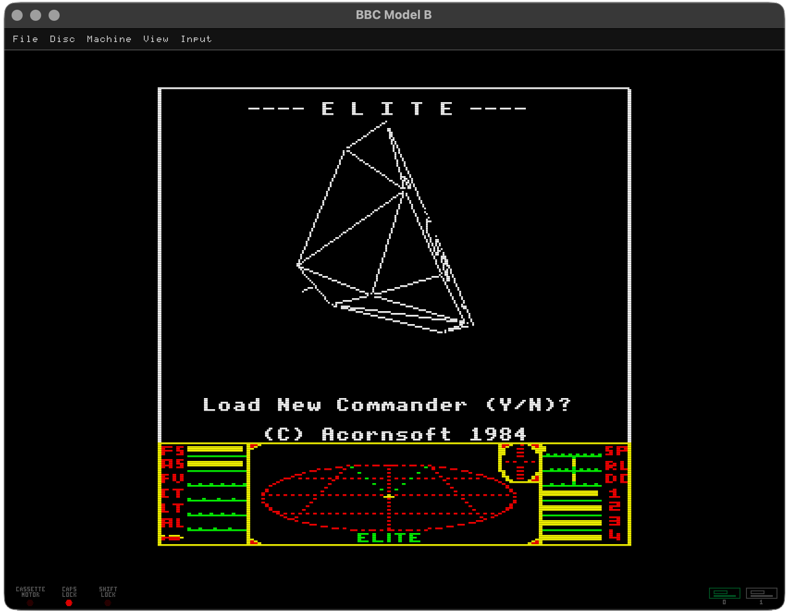

# BBC Model B Emulator

A C#/.NET BBC Micro Model B emulator. I have tried to build it with a level of authenticity that makes operating the BBC feel right including fully emulating the 2 MHz NMOS 6502, OS 1.20, BASIC II, Acorn DFS, the 8271 disc controller, the system and user 6522 VIAs, the BBC video hardware, the SN76489 sound chip, and the keyboard matrix.

This has been a practical if not slightly obsessive project. Compatibility has been earned the slow way by booting the game, watching the loader, listening for the problematic little timing clues, and then going back through the hardware path until my mistake shows itself.



## Requirements

- .NET 9 SDK
- SDL2 runtime support through `ppy.SDL2-CS`
- BBC ROM images in `ROMS/`

Expected ROMs:

```text
ROMS/OS12.rom
ROMS/BASIC2.rom
ROMS/HiBASIC.rom
ROMS/DFS-0.9.rom
ROMS/AMXMSE331.rom
ROMS/DNFS302.rom
ROMS/6502tube_120.rom
```

`HiBASIC.rom` is used as the bank 15 BASIC ROM when the 65C02 Tube co-processor is enabled. A normal non-Tube boot still uses `BASIC2.rom`.

`AMXMSE331.rom` is optional for a normal BBC boot and is not loaded by default. I keep it listed because AMX software is a useful test of the mouse path, and especially useful with the Repton 3 editor.

`DNFS302.rom` and `6502tube_120.rom` are only needed when the 65C02 Tube co-processor is enabled.

## Build

```bash
dotnet build BBC_MODEL_B.csproj
```

## Run

Start at BASIC:

```bash
dotnet run --project BBC_MODEL_B.csproj
```

Boot a DFS disc image:

```bash
dotnet run --project BBC_MODEL_B.csproj -- Games/Superior/Repton3.ssd
```

Mount a disc but stay at BASIC:

```bash
dotnet run --project BBC_MODEL_B.csproj -- --no-autoboot Games/Misc/AMXArt.ssd
```

Mount a raw host file:

```bash
dotnet run --project BBC_MODEL_B.csproj -- path/to/file
```

Change CPU speed:

```bash
dotnet run --project BBC_MODEL_B.csproj -- --speed 50% Games/Acornsoft/Elite.ssd
dotnet run --project BBC_MODEL_B.csproj -- --speed 0.5 Games/Acornsoft/Elite.ssd
```

The speed scale is held back until MOS has reached its input path. That is intentional: the first few seconds are part of the machine's character, especially the startup sound, so I let that happen at normal speed before applying the requested scale.

## Command-Line Options

```text
--disc PATH
--disk PATH
--file PATH        Mount a DFS image or host file.

--drive0 PATH
--drive1 PATH      Mount an SSD/DSD image in a physical drive.
--drive2 PATH
--drive3 PATH      Mount an SSD image in a DFS logical drive slot.
--blank-ssd PATH   Create a blank SSD image if the file does not exist.
--blank-dsd PATH   Create a blank DSD image if the file does not exist.
                  If no --driveN option names that image, it is mounted in drive 0.

--boot-disc        Run the mounted disc's boot path. This is the default.
--no-boot-disc
--no-autoboot      Mount the disc and leave the BBC at BASIC.

--headless-ms N    Run without a window for N milliseconds.
--speed VALUE      CPU speed scale, for example 0.5 or 50%.
--print-autoload   Print the DFS !BOOT command for a bootable image.
--load-state PATH  Restore a .sav state before running the emulator.

--tube-6502        Start with the 65C02 Tube co-processor enabled.
--tube-host-rom PATH
                  Use a specific BBC-side Tube host ROM instead of ROMS/DNFS302.rom.
--tube-6502-rom PATH
                  Use a specific parasite ROM instead of ROMS/6502tube_120.rom.
```

Plain paths are accepted too:

```bash
dotnet run --project BBC_MODEL_B.csproj -- Games/Acornsoft/Elite.ssd
```

Resume a saved machine state:

```bash
dotnet run --project BBC_MODEL_B.csproj -- --load-state Saves/Elite.sav
```

## 65C02 Tube Co-Processor

The emulator includes an Acorn Tube ULA bridge and a 65C02 second processor. In Tube mode the BBC side uses `DNFS302.rom` in the DFS ROM bank, and the parasite side boots from `6502tube_120.rom` with its own 64 KiB memory space.

Start with the Tube enabled from the command line:

```bash
dotnet run --project BBC_MODEL_B.csproj -- --tube-6502 Games/Acornsoft/Elite-CoPro.ssd
```

The SDL Machine menu also has a `6502 Co-Processor` toggle. It changes the hardware configuration and swaps the DFS/DNFS ROM bank, but it does not force the BBC to re-detect the Tube. Use `Ctrl-BREAK` after enabling or disabling it, just as you would when changing the hardware under a running machine.

With `ROMS/HiBASIC.rom` present, Tube mode enters HI-BASIC through the normal `*BASIC` language ROM path. A quick check is:

```text
PRINT PAGE
PRINT HIMEM
```

HI-BASIC should leave `PAGE` at `&0800` and raise `HIMEM` to `&B800` in the Tube's 64 KiB memory space.

The Tube CPU is advanced from host 6502 cycles rather than from a free-running host thread. That keeps the Tube protocol timing tied to the BBC side, which is important for software that is sensitive to the R1-R4 FIFO handshakes and NMI timing.

## Controls

### SDL Menu

The SDL window has a compact top menu for gameplay/session actions:

```text
File      Save screenshot, open/save state, quit
Disc      Mount/eject drive 0, mount/eject drive 1, create blank SSD
Machine   BREAK, Shift-BREAK, Ctrl-BREAK, 6502 Co-Processor, pause
ROM Manager  Edit sideways ROM banks, import/export ROM layouts
View      Fullscreen, scanlines
Input     Paste clipboard, Shift Lock
```

Disc menu mounts behave like inserting media into a real drive: they do not auto-boot the disc. Use `Shift-BREAK` from the Machine menu or keyboard when you want to boot the mounted disc. `.zip` archives can be selected without extracting them; the emulator scans for `.ssd` and `.dsd` entries, presents folders and disc images in a searchable chooser, and streams only the selected image into the drive as read-only media. While the archive chooser is open, type to filter folders and disc names, use arrow keys to navigate, and press Return to select a disc. `Create blank SSD` uses the first empty physical drive, preferring drive 0; if both drives are occupied, the menu item is unavailable.

Save states are written from the File menu using the host file picker and use a `.sav` extension. Successful saves and opens are added to a small recent-state list in the File menu, so commonly used states can be reopened without reopening the file picker. The snapshot includes BBC RAM and device state, mounted DFS image state, sideways ROM bank contents and paths, and the 65C02 Tube state when the co-processor is enabled. Save states are tied to the current emulator save-state format; older save-state formats are rejected rather than converted.

`ROM Manager` shows the BBC's 16 logical sideways ROM banks as two rows of chip sockets. Empty banks can be filled from the native host file picker, occupied banks show ROM title/type and language/service entry information, and non-system ROMs can be removed or moved to an empty bank. Bank 15, the BASIC ROM bank, is protected; bank 14, the filing-system ROM bank, can be replaced so you can swap DFS for alternatives such as a 1770 DFS ROM. The manager can export the current bank-to-ROM-path pattern as a named JSON layout and import a chosen layout later; layouts are explicit files and are not loaded automatically at boot. The emulator pauses while the manager is open and performs a power-on reset when the ROM pattern has changed.

### Host Shortcuts

```text
F12                     BBC BREAK
Shift+F12               BBC Shift-BREAK
Ctrl+F12                BBC Ctrl-BREAK
Ctrl+P                  Pause or resume emulation
Space                   Advance 10 frames while paused, including Tube co-processor cycles
F11                     Toggle scanline overlay
Ctrl+S / Cmd+S          Save screenshot to Screenshots/ (mapper closed)
Ctrl+S / Cmd+S          Save the current input map (mapper open)
Ctrl+T                  Toggle runtime and 8271 disc trace logging
Ctrl+L / Cmd+L          Open host file picker and mount selected file
Ctrl+V / Cmd+V          Paste host clipboard text into the BBC keyboard buffer
Left Ctrl+Left Shift    Toggle BBC SHIFT LOCK
```

### Keyboard

Most keys go through the BBC keyboard matrix rather than being treated as host characters. That matters, because plenty of BBC software reads the matrix directly. A few mappings are worth knowing:

```text
Host arrow keys   BBC cursor keys
F1-F10            BBC function keys
F12               BBC BREAK
Insert / §        BBC COPY
Backspace/Delete  BBC DELETE
```

On macOS, `§` is also used for the BBC `COPY` key.

Host Caps Lock follows the BBC `CAPS LOCK` key. `Left Ctrl+Left Shift` toggles a BBC-style `SHIFT LOCK` by holding the BBC Shift matrix key down until the chord is pressed again.

The `Input` menu includes a visual keyboard mapper. Open `Input > Keyboard Mapper`, click a BBC key, then press the host key you want to bind to it. The mapper is file-based rather than disc-based: `Input > Save Map` prompts for a JSON profile name and location, `Input > Open Map` opens a chosen profile, and profiles are never loaded automatically when discs change. `Input > Reset Map` returns the current map to the emulator default. If `Assets/DefaultInputProfile.json` exists, it is loaded at startup and used as that default; otherwise the built-in BBC keyboard layout is used.

The bottom border includes small status LEDs for cassette motor, caps lock, and shift lock at the bottom left. The disc drives sit at the bottom right as front-panel glyphs: the red LED follows 8271 activity, the grey lever shows whether media is inserted, and the `40`/`80` selector shows whether the mounted image is single- or double-sided. When the 65C02 Tube co-processor is active, the top menu bar shows a right-aligned `SECOND PROCESSOR` label with a red LED.

### Serial / RS423

`SerialACIA` models the BBC's cassette/RS423 ACIA and Serial ULA registers. The functional Hayes modem sits behind this path and can be enabled from `Machine > Hayes Modem`, or at startup with `BBC_HAYES_MODEM=1`.

```bash
BBC_SERIAL_TRACE=1 BBC_SERIAL_LOOPBACK=1 dotnet run -- --no-autoboot --drive0 Assets/scratchDisc.ssd
BBC_SERIAL_TRACE=1 BBC_HAYES_MODEM=1 dotnet run -- --no-autoboot --drive0 Assets/scratchDisc.ssd
```

Loopback returns each transmitted byte. The ACIA decodes the BBC-side baud, data bits, parity, stop bits, RTS, CTS, and break state from the 6850 control register and Serial ULA. `BBC_SERIAL_LOOPBACK=1` enables the low-level ACIA loopback path; the Hayes menu has its own `Loopback` item that echoes bytes through the modem layer.

The Hayes panel appears in a boxed overlay at the bottom centre while the modem is enabled. Its LEDs follow the familiar front-panel names: `AA`, `CD`, `OH`, `RD`, `SD`, `TR`, and `MR`. `CD` and `OH` light while a TCP connection is open, `RD` and `SD` flash for modem-to-BBC and BBC-to-modem data, `TR` follows BBC RTS, and `MR` shows that the modem object is active. The Hayes drop-down menu opens above the panel and provides `Loopback` and `Reset`; reset drops any connection, clears loopback and command state, and returns the modem to command mode.

The Hayes modem handles command mode and TCP-backed connected mode. `ATDThost:port` opens a host TCP connection, defaulting to port 23 when no port is supplied. `ATDPhost:port` is accepted as the pulse-dial equivalent. A successful dial returns `CONNECT host port`; connection failure returns `NO CARRIER`. `ATDhost:port`, `ATDT host:port`, and space-separated `ATDhost port` forms are rejected because the dial command must include the tone or pulse modifier immediately before the target. `ATH` hangs up, `ATZ` resets the command state and hangs up, `ATO` returns to online mode after escaping, and `+++` escapes from connected mode back to command mode.

The parser accepts common setup strings used by terminal software without trying to emulate every analogue modem feature. `ATE0/1`, `ATQ0/1`, `ATV0/1`, and `ATM0/1/2` set echo, result-code quiet mode, numeric/verbose result codes, and speaker mode. `ATI` prints the modem identity. `AT&F` restores defaults, `AT&V` prints the active configuration, `AT&C0/1` controls whether carrier is forced on or follows the TCP connection, and `AT&D`, `AT&K`, `AT&Q`, and `AT&S` are accepted as stored compatibility settings. `ATS0`, `ATS2`, and `ATS12` can be queried or assigned; S0 stores auto-answer rings, S2 controls the escape character, and S12 controls the escape guard time in fiftieths of a second. Commands that are not implemented return `ERROR`.

Incoming modem data is buffered by the Hayes modem and metered back through the ACIA at a fixed 2400 baud. The Hayes modem expects the BBC serial side to be configured for 2400 baud, 8 data bits, and no parity. One or two stop bits are accepted, and output pauses while BBC RTS is inactive.

### Joysticks

SDL game controllers and raw joysticks are opened automatically. The keyboard fallback is deliberately simple:

```text
Left arrow   Joystick left
Right arrow  Joystick right
Up arrow     Joystick up
Down arrow   Joystick down
Space        Fire
```

Physical controller mapping:

```text
Left stick X/Y or raw axes 0/1   Analogue joystick
D-pad or hat                     Switched joystick directions
Button A or raw button 0          Fire
```

BBC analogue joystick reads follow the `ADVAL` convention used here:

```text
ADVAL(1): left  = 65535, right = 0
ADVAL(2): up    = 65535, down  = 0
ADVAL(0): fire  = 1 when pressed
```

Switched joysticks sit on the user 6522 VIA as active-low lines:

```text
PB0 = Up
PB1 = Down
PB2 = Left
PB3 = Right
PB4 = Fire
```

### Mouse And AMX

AMX mouse support uses host relative mouse capture, so the emulated pointer can keep moving even when the host pointer would otherwise hit the edge of the window. It is one of those corners where a tiny host convenience has to disappear behind the BBC's expectations.

Inside the BBC, the useful commands are:

```text
*MOUSE ON
*MOUSE OFF
*POINTER ON
*POINTER OFF
```

`ROMS/AMXMSE331.rom` is not loaded by default. Use `ROM Manager` to add it to sideways bank 13 when you want the AMX ROM active. `*MOUSE` and `*POINTER ON/OFF` still update the host capture state through the fallback path when the ROM is not loaded, because AMX titles do not all enable the pointer in the same order.

`Games/Misc/AMXArt.ssd` can be launched directly:

```bash
dotnet run --project BBC_MODEL_B.csproj -- Games/Misc/AMXArt.ssd
```

For a manual AMX Art start, this is the useful sequence:

```text
*KEY 10 CHAIN "!MENU"|M
*POINTER ON
*MOUSE ON
*BREAK
CHAIN "!MENU"
```

The emulator handles the boot `*EXEC !BOOT` path and queues the soft-key continuation after `*BREAK`.

## Discs And Loading

DFS `.ssd` and `.dsd` images can be mounted from the command line, drag/drop, or the host file picker.

`--drive0` and `--drive1` name the physical BBC drives. An SSD uses the drive you mount it in. A DSD uses both sides of that physical drive: drive 0 maps to DFS drives 0 and 2, while drive 1 maps to DFS drives 1 and 3.

Two double-sided images are mounted by using the two physical drives:

```bash
dotnet run --project BBC_MODEL_B.csproj -- --no-autoboot --drive0 first.dsd --drive1 second.dsd
```

Blank images default to drive 0 if you do not say otherwise:

```bash
dotnet run --project BBC_MODEL_B.csproj -- --no-autoboot --blank-ssd save.ssd
```

When you do care about the drive, the command says both what to make and where to put it:

```bash
dotnet run --project BBC_MODEL_B.csproj -- --no-autoboot --blank-ssd save.ssd --drive1 save.ssd
dotnet run --project BBC_MODEL_B.csproj -- --no-autoboot --blank-dsd work.dsd --drive0 work.dsd
```

`--drive2` and `--drive3` are there for explicit SSD logical-drive mounts. DSD images must be mounted through physical drive 0 or 1 so the emulator can keep the two sides paired.

The loading path is deliberately split in two, because the neat version of this design would be less honest than the useful one:

- `Intel8271_Disk` models the Acorn 8271-facing hardware that DFS talks to.
- `HostFilingSystem` sits outside DFS and only handles the small MOS shortcuts that make a raw host file practical to load.

The 8271 emulation is good enough for ordinary DFS disc work rather than just loading games. DFS can catalogue, load, save, delete, copy between mounted drives, verify sectors, and write changes back to the host image. The Welcome disc has also been used to format and verify a scratch SSD in drive 1; the format reported `00 format errors` and `00 verify errors`, and `*CAT 1` then showed a blank catalogue.

`--blank-ssd` and `--blank-dsd` are still the quickest way to create fresh host images, but they are convenience shortcuts. BBC-side formatting through DFS utilities can also reinitialise an existing mounted DFS image.

Boot behaviour:

- DFS option 3 with `!BOOT` queues `*EXEC !BOOT`.
- Discs without that boot path are mounted but left at BASIC.
- Use `--no-autoboot` when you want to inspect a disc manually.

### Disc Drive Sound

5.25 inch drive noise is mixed into the main audio path from WAV samples in `Assets`. The 8271 emulation raises passive motor and seek events, so drive sound follows DFS activity without changing disc timing. The drive samples are mixed at a fixed gain chosen to keep the mechanics audible alongside the SN76489 output.

The drive WAV samples are from the b-em BBC Micro emulator, which is licensed under the GPL. See `THIRD_PARTY_NOTICES.md` for the source details and acknowledgement.

## Screenshots

Press `Ctrl+S` or `Cmd+S` to write a PNG to:

```text
Screenshots/
```

Screenshot and save-state filenames include the mounted disc or host-file title when one is available.

## Project Layout

BBC documentation traditionally calls the memory-mapped I/O page at `&FE00-&FEFF` `SHEILA`. I use the same name here. It means the I/O page, not a separate chip.

```text
SRC/                  Emulator hardware, host UI, audio, and filing-system wiring
SRC/6502/             NMOS 6502 core, registers, flags, and memory bus
ROMS/                 OS, BASIC, DFS, and optional AMX ROMs
Games/                DFS disc images used for testing and play
Screenshots/          Runtime screenshot output
SRC/uPD7002_ADC.cs        Analogue joystick/paddle converter at &FEC0-&FEC3
SRC/SerialACIA.cs         Cassette/RS423 ACIA and Serial ULA state
SRC/Intel8271_Disk.cs     Acorn 8271 DFS disc controller surface
SRC/Display.cs            SDL window plus BBC keyboard, mouse, and joystick input
SRC/HostFilingSystem.cs   MOS shortcuts for loading a raw host file
SRC/Emulator.cs           Memory map, ROM loading, CLI, and hardware wiring
SRC/SAA5050_Font.cs       Mode 7 teletext glyphs
SRC/SN76489_Sound.cs      SN76489 PSG and internal speaker output
SRC/DiscDriveSound.cs     5.25 inch drive motor and seek sample playback
SRC/System6522Via.cs      System 6522 VIA: keyboard, slow bus, timers, VSYNC
SRC/User6522Via.cs        User 6522 VIA: user port, joystick, mouse pulses
SRC/HD6845_Video.cs       CRTC, Video ULA, Mode 7, and framebuffer rendering
```

## Legal Note

This emulator is distributed under the GNU General Public License version 2. See `COPYING`.

BBC Micro ROMs and commercial software images remain the property of their respective rights holders. This emulator is for educational and preservation-oriented development.
