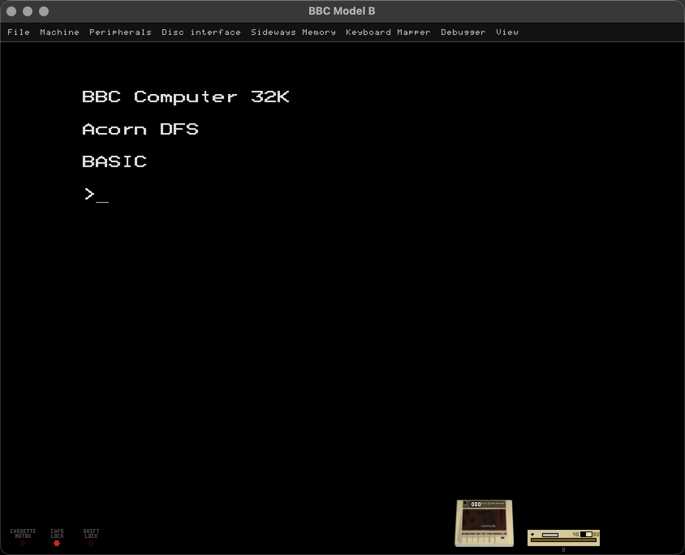
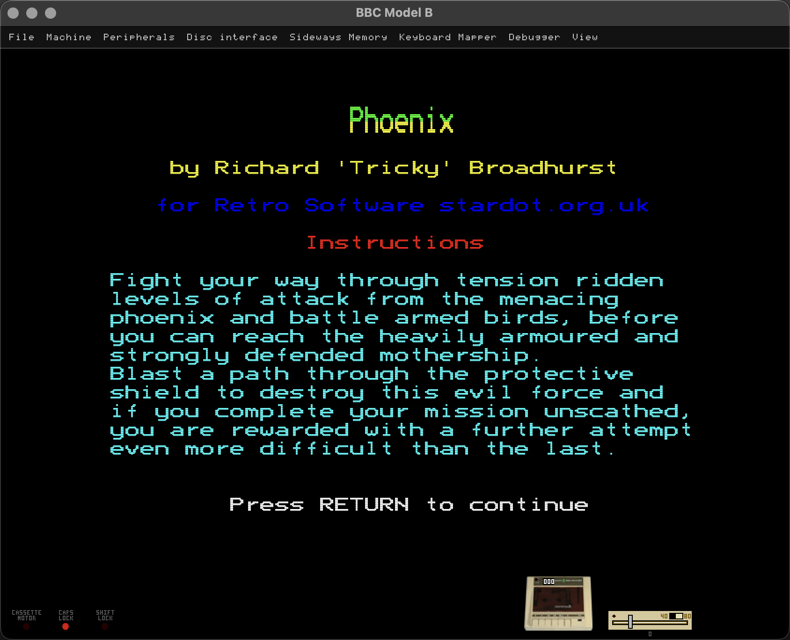

# BBC Model B Emulator

A BBC Micro Model B emulator written in C# and .NET.

I wrote this to feel more like a real Beeb rather than just a launcher for disc images.
It emulates the 6502, OS 1.20, BASIC II, DFS, the 8271 disc controller, the VIAs, video, sound, keyboard matrix, tape, serial hardware, joysticks, AMX-style mouse input, a Hayes modem, and an optional 65C02 Tube second processor.

<p>
    
    
</p>

## Requirements

- .NET 9 SDK
- SDL2 runtime support through `ppy.SDL2-CS`
- BBC ROM images in `ROMS/`

The normal boot expects:

```text
ROMS/OS12.rom
ROMS/BASIC2.rom
ROMS/DFS-0.9.rom
```

Optional ROMs add extra hardware or modes:

```text
ROMS/HiBASIC.rom        Tube BASIC
ROMS/DNFS302.rom        BBC-side Tube host ROM
ROMS/6502tube_120.rom   65C02 Tube parasite ROM
ROMS/AMXMSE331.rom      AMX mouse ROM
```

## Build And Run

Build it:

```bash
dotnet build BBC_MODEL_B.csproj
```

Start at BASIC:

```bash
dotnet run --project BBC_MODEL_B.csproj
```

Boot a disc image:

```bash
dotnet run --project BBC_MODEL_B.csproj -- Games/Defender-Atarisoft.ssd
```

Mount a disc but stay at BASIC:

```bash
dotnet run --project BBC_MODEL_B.csproj -- --no-autoboot Games/Defender-Atarisoft.ssd
```

Load a tape:

```bash
dotnet run --project BBC_MODEL_B.csproj -- --tape Games/Elite-v1.0_B.uef
```

Run with the Tube or modem enabled:

```bash
dotnet run --project BBC_MODEL_B.csproj -- --tube-6502 Games/Elite-SRR_B/Elite-SRR_B.uef
dotnet run --project BBC_MODEL_B.csproj -- --modem
```

## Command Line

Plain paths are accepted. Disc images boot by default, tape images enable the tape player, and explicit drive options enable the matching drive before mounting.

```text
--disc PATH
--disk PATH
--file PATH         Mount a disc image, tape image, or host file.

--tape PATH         Enable the tape player and mount a UEF tape.

--drive0 PATH
--drive1 PATH       Enable that physical drive and mount SSD, DSD, or ZIP media.
--drive2 PATH
--drive3 PATH       Mount an SSD in a DFS logical drive slot.

--blank-ssd PATH    Create a blank SSD image if needed.
--blank-dsd PATH    Create a blank DSD image if needed.

--boot-disc         Boot mounted discs. This is the default.
--no-boot-disc
--no-autoboot       Mount media and leave the BBC at BASIC.

--speed VALUE       Run slower or faster after startup, for example 0.5 or 50%.
--type TEXT         Type text into the BBC keyboard buffer after boot.
--load-state PATH   Restore a .sav state before running.
--headless-ms N     Run without a window for N milliseconds.
--print-autoload PATH
                   Print the !BOOT command for a bootable DFS image.

--tube-6502         Start with the 65C02 Tube co-processor enabled.
--tube-host-rom PATH
--tube-6502-rom PATH
                   Use non-default Tube ROMs.

--modem             Start with the Hayes modem enabled.
```

Examples:

```bash
dotnet run --project BBC_MODEL_B.csproj -- --drive0 game.ssd --drive1 data.dsd
dotnet run --project BBC_MODEL_B.csproj -- --blank-ssd work.ssd --drive1 work.ssd --no-autoboot
dotnet run --project BBC_MODEL_B.csproj -- --load-state Saves/Elite.sav
dotnet run --project BBC_MODEL_B.csproj -- --speed 50% game.ssd
```

## Menus

The SDL window has a small menu bar for the common jobs:

```text
File         Screenshot, save state, open state, quit
Disc         Mount, eject, or create blank SSD media
Machine      BREAK, tape player, modem, disc drives, Tube, sound, pause
ROM Manager  Edit sideways ROM banks and import/export ROM layouts
View         Fullscreen and scanlines
Input        Paste text, Shift Lock, keyboard mapper
```

A few useful details:

- Disc menu loads accept `.ssd`, `.dsd`, and `.zip`. ZIP files are browsed without extracting them.
- Drive 0 is on by default. Drive 1 is off until enabled from `Machine` or used from the command line.
- The tape player is on by default. The Hayes modem is off until enabled from `Machine` or started with `--modem`.
- Menu disc mounts behave like inserting a disc. They do not auto-boot; use `Shift-BREAK` when you want to boot.
- Save states use `.sav` files and are opened or saved from the `File` menu.
- Screenshots go into `Screenshots/`.

## Keys

Most keys go through the BBC keyboard matrix, so games that read the keyboard directly behave properly.

```text
F12                     BREAK
Shift+F12               Shift-BREAK
Ctrl+F12                Ctrl-BREAK
Ctrl+P                  Pause or resume
Space                   Advance 10 frames while paused
F11                     Toggle scanlines
Ctrl+S / Cmd+S          Save screenshot
Ctrl+L / Cmd+L          Open the disc picker
Ctrl+V / Cmd+V          Paste clipboard text into the BBC
Ctrl+Shift+R            Open the ROM Manager
Ctrl+Shift+K            Open the Keyboard Mapper
Left Ctrl+Left Shift    Toggle BBC SHIFT LOCK
```

Host arrow keys map to the BBC cursor keys, `F1` to `F10` map to BBC function keys, and `Insert` or `§` maps to BBC `COPY`.

The keyboard mapper is in `Input > Keyboard Mapper`. Click a BBC key, press the host key you want, then save the map if you want to keep it. If `Assets/DefaultInputProfile.json` exists, it is loaded at startup.

## Discs, Tapes, And Drives

The emulator supports DFS `.ssd` and `.dsd` images, UEF tapes, and ZIP archives containing disc images.

Physical drive 0 maps to DFS drives 0 and 2. Physical drive 1 maps to DFS drives 1 and 3. That matters for double-sided DSD images: mount them with `--drive0` or `--drive1` so both sides stay together.

You can create blank media from the menu or command line. DFS can also catalogue, load, save, delete, copy, verify, and format mounted images from inside the BBC.

5.25 inch drive sounds are mixed into the main audio path from samples in `Assets/DriveNoise`. The sample source is credited in `THIRD_PARTY_NOTICES.md`.

## Optional Hardware

The Machine menu lets you add or remove hardware while the emulator is running:

- `Tape Player` toggles the cassette hardware and tape controls.
- `Hayes Modem` enables the modem and its front-panel LEDs.
- `Disc Drive 0` and `Disc Drive 1` enable or remove each physical drive.
- `6502 Co-Processor` enables the Tube hardware. Use `Ctrl-BREAK` after changing it so the BBC sees the new machine.

The Hayes modem accepts familiar AT commands such as `AT`, `ATZ`, `ATH`, `ATO`, `ATE0/1`, `ATV0/1`, `AT&F`, and `ATDThost:port`. A successful dial opens a TCP connection, defaulting to port 23 if no port is given. The BBC serial side should be set to 9600 baud, 8 data bits, no parity.

AMX mouse support is available through the ROM Manager. Add `ROMS/AMXMSE331.rom` to a sideways ROM bank, then use the usual BBC commands such as `*MOUSE ON` and `*POINTER ON`.

## Project Layout

```text
SRC/                 Emulator hardware, SDL UI, audio, loading, and machine wiring
SRC/6502/            6502 CPU core
ROMS/                BBC ROM images
Games/               Disc and tape images used for testing and play
Assets/              Config files, drive sounds, and sample media
Screenshots/         Runtime screenshot output
```

The main files are named after the hardware they emulate: `Intel8271_Disk.cs`, `System6522Via.cs`, `User6522Via.cs`, `SerialACIA.cs`, `SN76489_Sound.cs`, `TubeUla.cs`, `HD6845_Video.cs`, and so on. `Emulator.cs` ties the machine together.

## Legal Note

This emulator is distributed under the GNU General Public License version 2. See `LICENSE`.

BBC Micro ROMs and commercial software images remain the property of their respective rights holders. Use your own legally obtained copies.
